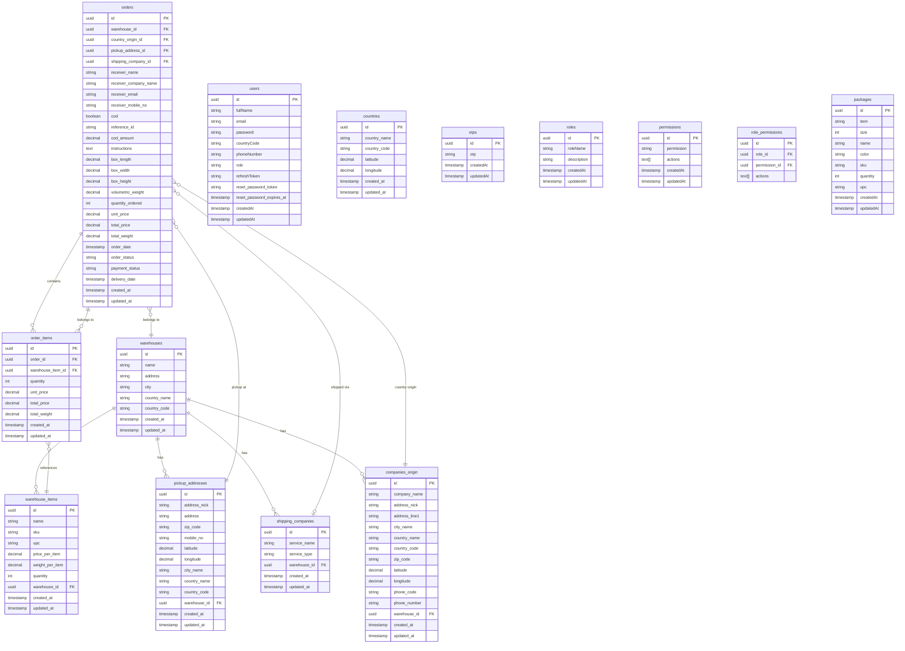

# Inventory Backend — Architecture, ERD & Repository Overview

**Document purpose:** Client-facing backend overview (architecture, data model, repository structure).  
**Project:** MachKnow Inventory Management — Backend  
**Last updated:** February 2026  

---

## 1. Architecture Overview

### Stack
- **Runtime:** Node.js  
- **Framework:** NestJS 11  
- **Language:** TypeScript  
- **Database:** PostgreSQL  
- **ORM:** TypeORM (entity auto-load from `src/**/*.entity{.ts,.js}`)  
- **API style:** REST (Express); optional Swagger  
- **Auth:** JWT (Passport), bcrypt for passwords  
- **Pattern:** CQRS (Commands & Queries) per domain  
- **i18n:** nestjs-i18n (e.g. `en`, `ar`)  

### High-level flow
```
HTTP Request → Nest Controller → Command/Query (CQRS) → Handler → TypeORM Repository → PostgreSQL
                                    ↓
                              DTOs + validation (class-validator)
```

### Backend modules (as registered in app)

| Module | Responsibility |
|--------|----------------|
| **UsersModule** | User CRUD, registration, login, password reset |
| **AuthModule** | JWT auth, guards |
| **WarehouseModule** | Warehouse CRUD |
| **WarehouseItemModule** | Warehouse items (inventory lines) per warehouse |
| **CompanyOriginModule** | Company/origin addresses linked to warehouses |
| **PickupAddressModule** | Pickup addresses per warehouse |
| **ShippingCompanyModule** | Shipping companies per warehouse |
| **OrderModule** | Orders and order line items (links warehouse, origin, pickup, shipping, items) |
| **I18nHelperModule** | Centralized i18n usage |

*Note: DashboardUsersModule, RolesModule, PermissionsModule exist in codebase but are currently commented out in `AppModule`.*

---

## 2. Entity Relationship Diagram (ERD)

### Mermaid ER diagram (core domains)



### Relationship summary
- **Warehouse** is the hub: has many **warehouse_items**, **pickup_addresses**, **shipping_companies**, **companies_origin**.
- **Order** belongs to one **warehouse**, one **company_origin**, one **pickup_address**, and optionally one **shipping_company**; has many **order_items**.
- **Order_item** belongs to one **order** and references one **warehouse_item**.
- **users**, **countries**, **otps**, **roles**, **permissions**, **role_permissions**, **packages** are standalone or RBAC-related; **packages** has no FKs in the current schema.

---

## 3. Repository structure (backend)

```
inventory-backend/
├── src/
│   ├── app.module.ts              # Root module, TypeORM + all feature modules
│   ├── main.ts                    # Bootstrap, port, global pipes
│   │
│   ├── auth/                      # JWT auth
│   │   ├── auth.module.ts
│   │   ├── auth.service.ts
│   │   └── auth.guard.ts
│   │
│   ├── users/                     # User management & auth-related
│   │   ├── user.module.ts
│   │   ├── user.controller.ts
│   │   ├── entities/              # users, otps
│   │   ├── commands/              # register, update, delete, etc.
│   │   ├── queries/
│   │   └── dtos/
│   │
│   ├── warehouse/
│   │   ├── warehouse.module.ts
│   │   ├── warehouse.controller.ts
│   │   ├── entities/              # warehouse.entity.ts
│   │   ├── commands/              # create, update, delete
│   │   ├── queries/               # get-all, get-single
│   │   └── dto/
│   │
│   ├── warehouse-item/
│   │   ├── warehouse-item.module.ts
│   │   ├── warehouse-item.controller.ts
│   │   ├── entities/              # warehouse-item.entity.ts
│   │   ├── commands/              # create, bulk create, update, delete
│   │   ├── queries/
│   │   └── dto/
│   │
│   ├── companies_origin_management/
│   │   ├── companies-origin.module.ts
│   │   ├── companies-origin.controller.ts
│   │   ├── entity/                # companies.entity.ts (CompanyOrigin)
│   │   ├── commands/
│   │   ├── queries/
│   │   └── dto/
│   │
│   ├── pickup-address/
│   │   ├── pickup-address.module.ts
│   │   ├── entities/
│   │   ├── commands/
│   │   ├── queries/
│   │   └── dto/
│   │
│   ├── shipping-company/
│   │   ├── shipping-company.module.ts
│   │   ├── entities/
│   │   ├── commands/
│   │   ├── queries/
│   │   └── dto/
│   │
│   ├── order/
│   │   ├── order.module.ts
│   │   ├── order.controller.ts (or similar)
│   │   ├── entities/              # order.entity.ts, order-item.entity.ts
│   │   ├── commands/              # create, update, delete order
│   │   ├── queries/
│   │   └── dto/
│   │
│   ├── package/                   # Present in codebase; not in AppModule
│   │   ├── package.module.ts
│   │   ├── package.controller.ts
│   │   ├── entities/              # package.entity.ts (standalone)
│   │   ├── commands/
│   │   ├── queries/
│   │   └── dto/
│   │
│   ├── country/
│   │   └── entities/              # country.entity.ts (reference data)
│   │
│   ├── user-management/           # Dashboard users (module commented out)
│   │   ├── dashboard-users.module.ts
│   │   ├── dashboard-users.controller.ts
│   │   ├── commands/
│   │   ├── queries/
│   │   └── dtos/
│   │
│   ├── roles-management/
│   │   ├── roles.module.ts
│   │   ├── roles.controller.ts
│   │   ├── entities/              # roles, role_permissions
│   │   ├── commands/
│   │   ├── queries/
│   │   └── dtos/
│   │
│   ├── permissions-management/
│   │   ├── permissions.module.ts
│   │   ├── permissions.controller.ts
│   │   ├── entity/                # permissions.entity.ts
│   │   └── queries/
│   │
│   ├── i18n/                      # i18n helper service
│   ├── middlewares/               # roles decorator, roles guard
│   └── common/                    # Shared utilities
│
├── test/                          # e2e tests
├── scripts/                       # Build/deploy (e.g. copy webconfig, certs)
├── package.json
├── tsconfig.json
├── nest-cli.json
├── .env.example
├── DEPLOYMENT_GUIDE.md
├── DIRECT_DEPLOYMENT_GUIDE.md
└── QUICK_START.md
```

### CQRS layout (typical domain)
- **commands/impl/** — Command classes (e.g. `CreateOrderCommand`).
- **commands/handlers/** — Command handlers (execute write logic, use TypeORM repos).
- **queries/impl/** — Query classes.
- **queries/handlers/** — Query handlers (read logic).
- Controllers dispatch commands/queries via `CommandBus` / `QueryBus`.

---

## 4. How to use this document

- **Share:** Attach this file (or export to PDF) and send to the client.
- **ERD:** The Mermaid diagram can be rendered in GitHub, GitLab, Notion, or [mermaid.live](https://mermaid.live) to export as PNG/SVG for slides or docs.
- **Repo:** Point the client to the `inventory-backend` repository; this doc describes the backend only.

I cannot send email from this environment; please attach `docs/CLIENT_BACKEND_OVERVIEW.md` (or its PDF export) to your email to the client.
